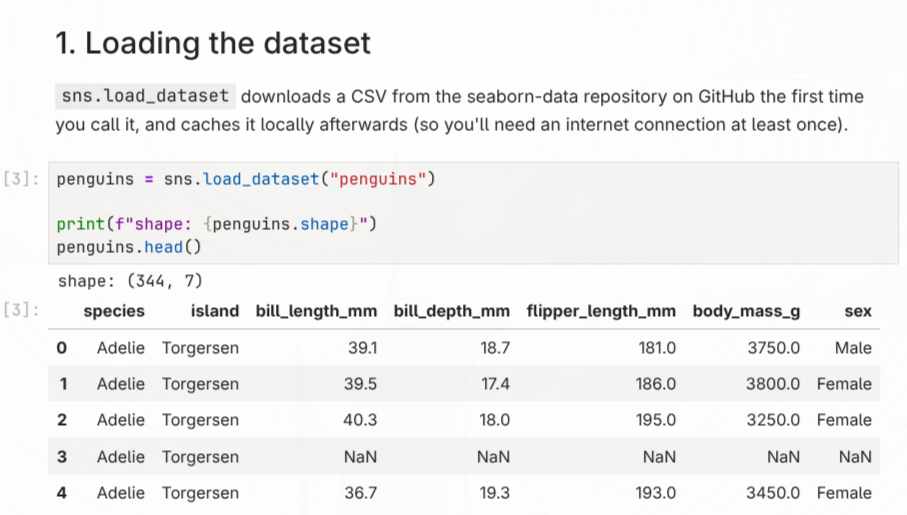

<!-- _class: title -->
<!-- _paginate: false -->
<!-- _footer: '' -->

# Prep Class ACLS
Part II - getting started with Python
03 September 2026

Jūlija Pečerska, Julian Kraft

---

# IDE

- **VS Code:** install the *Python* and *Jupyter* extensions if you haven't already
- **PyCharm:** Python support is built in - but get yourself the student license
- the folder you're working in is your **project/workspace**
- your IDE needs to know which **environment** to run your code in - more on that shortly

---

# Python Scripts

files end in `.py`:

```python
  import pandas as pd

  df = pd.read_csv('data.csv')
  df.head()
```

- run your scripts from the command line using `python <script>.py` or hit the run button in your IDE
- install a linter and formatter - e.g. `flake8` - to make them readable and consistent

---

# Jupyter Notebook



---

# Python Environment

- your code needs an **interpreter** plus the right **packages** installed - together that's your environment
- **conda/mamba** creates isolated environments per project, so package versions don't clash between projects
- this repo ships an `environment.yml` - one file that pins everything you need for the exercises during the first semester

---

### Conda/Mamba - best practices

- use `environment.yml` to define your environment
- keep it up to date for reproducibility
- delete environments when you're done with them - they can grow large and take up disk space

---

# GitHub

- **git** tracks changes to your code in a repository
- **GitHub** hosts your repositories and lets you collaborate
- together a powerful duo that will keep you organized and productive

---

### Git - best practices

- git is only supposed to track plain text (e.g. code) - never track weird stuff like Word files
- git will store anything you commit indefinitely:
  - never commit secrets or sensitive data
  - avoid uploading actual data files
  - keep your repos clean of any autogenerated clutter
- use .gitignore files to exclude stuff from being committed
- create reasonable commits with meaningful messages


---

### Git + Jupyter Notebooks - best practices

- never commit your notebook to git or at least strip its output
- use notebooks for interactive exploration, not for production code


